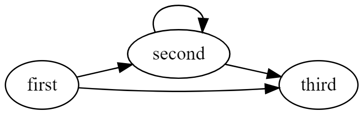

# Spring-Data Testbed

This is a little Spring Boot application I use for myself to explore ways to load a graph of entities efficiently.
The app itself is a standard web application using spring-data to access a H2 DB. The data model and data is set up using flyway. 

## Data Model

## Approaches

### Naive
This approach simply uses the entities in the business code without writing any custom queries.

**Advantages:**

- pretty simple to implement

**Disadvantages:**

- generates lots of queries while traversing through the graph of entities

### Custom Queries and BOs
This approach builds BOs from entities which are retrieved via custom JPQL queries. 

**Advantages:**

- Business code does not work on entities -> no accidential queries, room for customization 
- One query per entity type

**Disadvantages:**

- A lot of code to write, which kinda looks like duplicating JPA logic. *This approach was not explored yet*

### Entity Graphs
This aproach uses the relatively new Entity Graph feature to load a graph of queries with a single query. 

**Advantages:**

- potentially only one query

**Disadvantages:**

- The big query could be painfully slow, depending on the graph used and the data model
- still posibility of accidential queries

## REST Endpoints
- [http://localhost:8080/inefficient](http://localhost:8080/inefficient) - naive approach
- [http://localhost:8080/efficient](http://localhost:8080/efficient) - custom queries and BOs

## License
[MIT](https://choosealicense.com/licenses/mit/)